# A Clothing Store Project

An E commerce Store for Apparel with two main categories stitched and un stitched using react and react redux.

Working on all the important functionalities of an e commerce store. Working as a team two members using github for code sharing.

 <h2>
 Project Screen Shots
 </h2>
 

 <h3> Dashboard Screenshots </h3>
 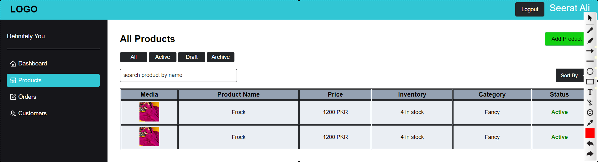
 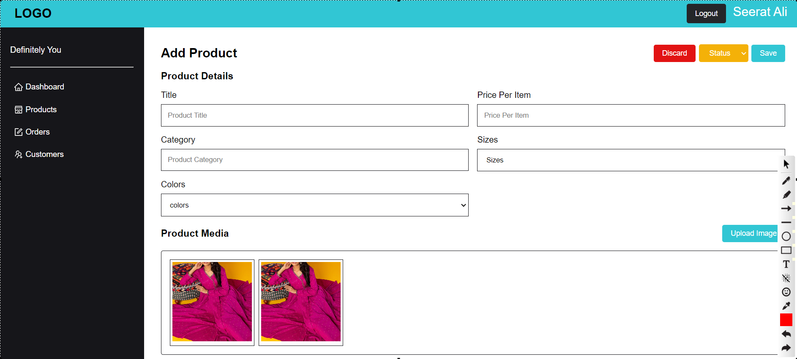
 
  <h3> Website Screenshots </h3>
  
  
  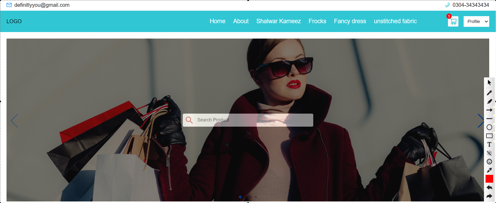
  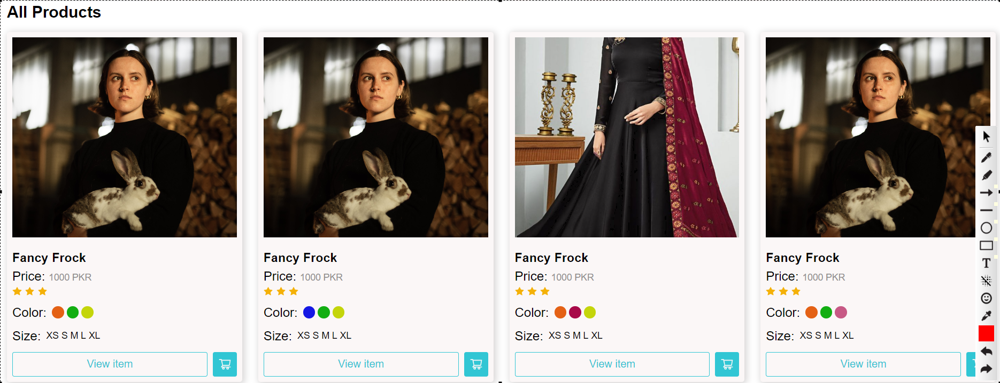
  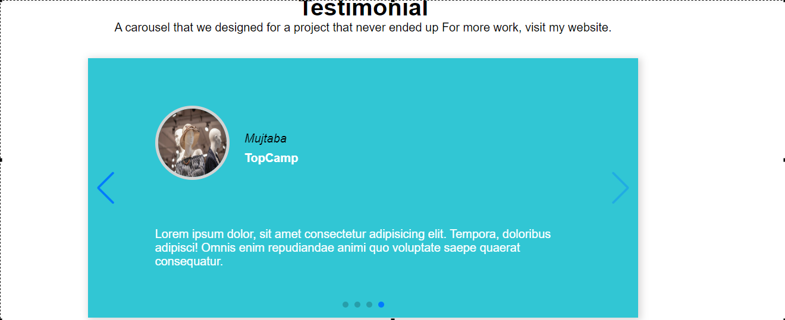
  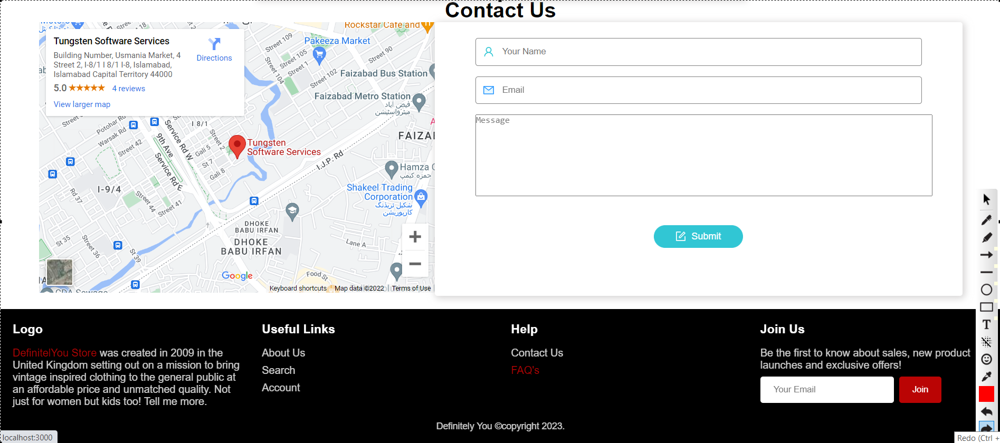
  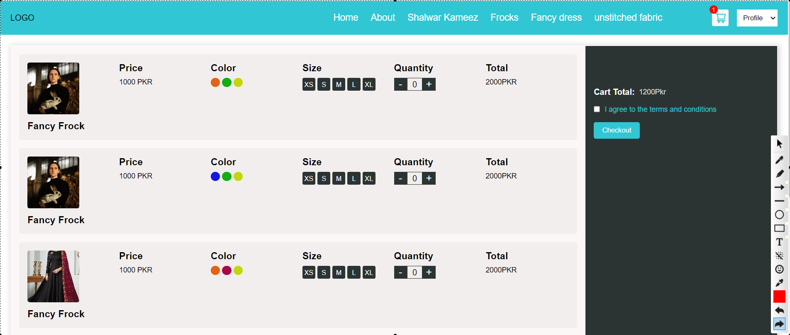
  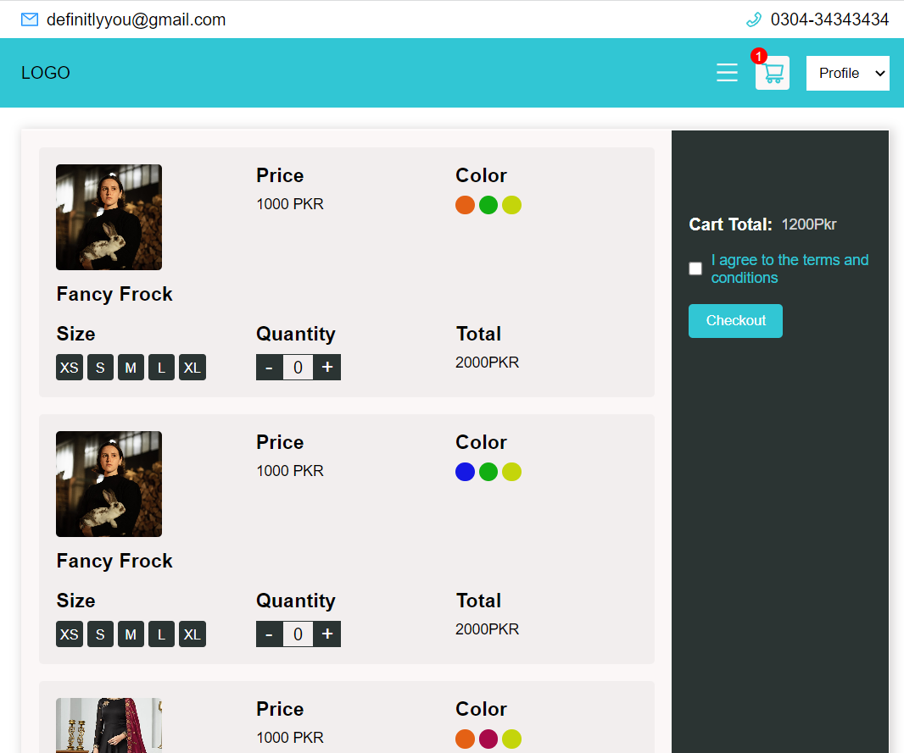
  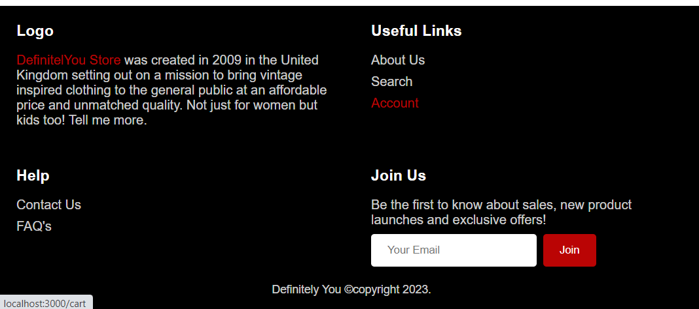
  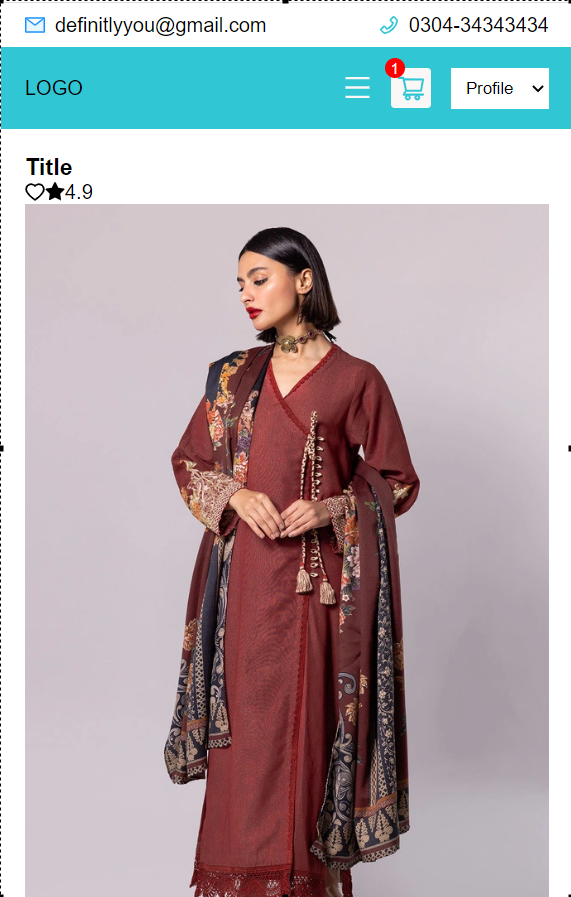
  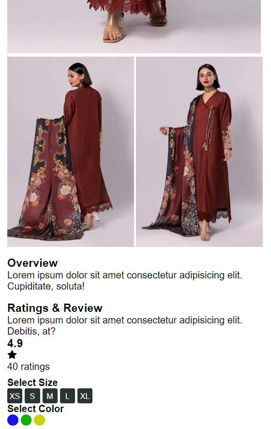
 

